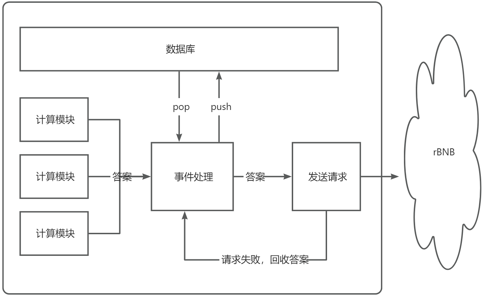

# rBNB

空气项目，虚假的 web3，仅供娱乐

```npm i pm2 -g```  
```npm i```  
```npm run gen-wallet```  
```npm run start``` 

## 优化

### 现状
项目方的服务大部分时间不可用，导致脚本大部分时间都在做无效的计算  

### 方案
将计算好的答案持久化存储，等服务正常的时候再发送  


